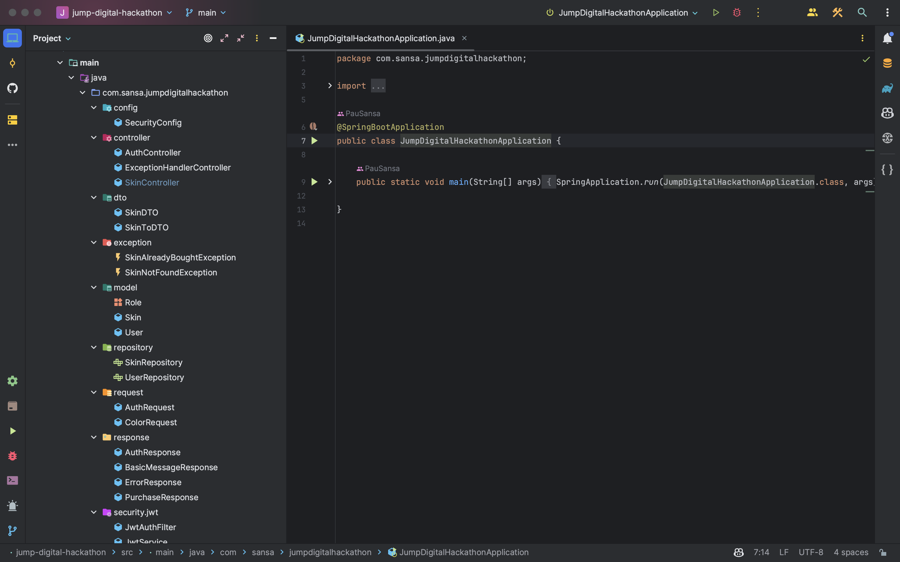

<!-- Improved compatibility of back to top link: See: https://github.com/PauSansa/Jump2DigitalHackathon/pull/73 -->
<a name="readme-top"></a>
<!--
*** Thanks for checking out the Best-README-Template. If you have a suggestion
*** that would make this better, please fork the repo and create a pull request
*** or simply open an issue with the tag "enhancement".
*** Don't forget to give the project a star!
*** Thanks again! Now go create something AMAZING! :D
-->


<!-- PROJECT SHIELDS -->
<!--
*** I'm using markdown "reference style" links for readability.
*** Reference links are enclosed in brackets [ ] instead of parentheses ( ).
*** See the bottom of this document for the declaration of the reference variables
*** for contributors-url, forks-url, etc. This is an optional, concise syntax you may use.
*** https://www.markdownguide.org/basic-syntax/#reference-style-links
-->
[![Contributors][contributors-shield]][contributors-url]
[![Stargazers][stars-shield]][stars-url]
[![Issues][issues-shield]][issues-url]
[![MIT License][license-shield]][license-url]
[![LinkedIn][linkedin-shield]][linkedin-url]


<!-- PROJECT LOGO -->
<br />
<div align="center">
  <a href="https://github.com/PauSansa/Jump2DigitalHackathon">
    
  </a>

  <h3 align="center">Pau Sansa's Solution</h3>

  <p align="center">
    This is my solution to the JUMP2DIGITAL Backend Hackathon
    <br />
</div>


<!-- TABLE OF CONTENTS -->
<details>
  <summary>Table of Contents</summary>
  <ol>
    <li>
      <a href="#about-the-project">About The Project</a>
      <ul>
        <li><a href="#built-with">Built With</a></li>
      </ul>
    </li>
    <li>
      <a href="#getting-started">Getting Started</a>
      <ul>
        <li><a href="#prerequisites">Prerequisites</a></li>
        <li><a href="#installation">Installation</a></li>
      </ul>
    </li>
    <li><a href="#usage">Usage</a></li>
    <li><a href="#contributing">Contributing</a></li>
    <li><a href="#license">License</a></li>
    <li><a href="#contact">Contact</a></li>
    <li><a href="#acknowledgments">Acknowledgments</a></li>
  </ol>
</details>


<!-- ABOUT THE PROJECT -->
## About The Project


### Project Goals

- Create a structured API for managing video game skins efficiently.
- Enable users to view and purchase skins from a collection of available options.
- Provide users with the ability to customize the color of their purchased skins.
- Allow users to delete unwanted skins from the user's collection.
- Store information about user-owned skins in a database for persistence.

### Features

- List all available skins for purchase.
- Purchase and store skins in a user's collection.
- View the user's collection of purchased skins.
- Customize the color of owned skins.
- Delete unwanted skins from the user's collection.
- Retrieve detailed information about a specific skin.

<p align="right">(<a href="#readme-top">back to top</a>)</p>


### Built With

In this project i've used the following tools

* [![Jav][Java]][Java-url]
* [![Mongo][MongoDB]][MongoDB-url]
* [![SPRING][Spring]][Spring-url]
* [![Jwt][JWT]][JWT-url]


<p align="right">(<a href="#readme-top">back to top</a>)</p>


<!-- GETTING STARTED -->
## Getting Started

This is an example of how you may give instructions on setting up your project locally.
To get a local copy up and running follow these simple example steps.

### Prerequisites

This is an example of how to list things you need to use the software and how to install them.
* Java
* MongoDB 


### Installation

_Below is an example of how you can instruct your audience on installing and setting up your app. This template doesn't rely on any external dependencies or services._

1. Clone the repo
   ```sh
   git clone https://github.com/PauSansa/Jump2DigitalHackathon
   ```
2. Enter your MongoDB creds in application.yml
   ```yml
   spring:
     data:
        mongodb:
            user: YOUR USER HERE
            password: YOUR PASSWORD HERE
   ```


<p align="right">(<a href="#readme-top">back to top</a>)</p>


<!-- USAGE EXAMPLES -->
## Usage

Run the main class JumpDigitalHackathonApplication in your favorite IDE and make sure to enable the Annotation Processing (it is a must to use lombook)

Register providing a username and password to the endpoint `/auth/register` with a json in the body. 

***Example***:
```json
  "username":"yourUsername",
  "password":"yourPassword"
```

 and send all requests with a Authentication Header with `Bearer HERE_YOUR_TOKEN`

 If your token expires, you can send one request to `/auth/login` with the same body as the register




<p align="right">(<a href="#readme-top">back to top</a>)</p>


## API Endpoints

### 1. List Available Skins

- **Description**: Retrieves a list of all available skins for purchase in the video game.
- **HTTP Method**: GET
- **Route**: `/skins/available`
- **Successful Response (200 OK)**:
  - Returns a list of JSON objects representing the skins available for purchase.
- **Skin not found (404 NOT FOUND)**:

### 2. Purchase a Skin

- **Description**: Allows users to acquire a skin and store it in the database.
- **HTTP Method**: POST
- **Route**: `/skins/buy/{skinId}`
- **Parameters**:
  - `skinId` (Path): The ID of the skin that the user wants to purchase.
- **Successful Response (200 OK)**:
  - Returns a success message along with details of the purchased skin.
- **Skin not found (404 NOT FOUND)**:

### 3. List My Skins

- **Description**: Retrieves a list of skins owned by the user.
- **HTTP Method**: GET
- **Route**: `/skins/myskins`
- **Successful Response (200 OK)**:
  - Returns a list of JSON objects representing the skins owned by the user.

### 4. Change Skin Color

- **Description**: Allows users to change the color of a purchased skin.
- **HTTP Method**: PUT
- **Route**: `/skins/color`
- **Request Body**: JSON object containing `skinId` and `color` fields.
- **Successful Response (200 OK)**:
  - Returns a success message upon successfully changing the color of the skin.
- **Skin not found (404 NOT FOUND)**:

### 5. Delete a Skin

- **Description**: Allows users to delete a purchased skin from their collection.
- **HTTP Method**: DELETE
- **Route**: `/skins/delete/{skinId}`
- **Parameters**:
  - `skinId` (Path): The ID of the skin to be deleted.
- **Successful Response (200 OK)**:
  - Returns a success message upon successfully deleting the skin.
- **Skin not found (404 NOT FOUND)**:

### 6. Get Skin Details

- **Description**: Retrieves details of a specific skin owned by the user.
- **HTTP Method**: GET
- **Route**: `/skins/getskin/{skinId}`
- **Parameters**:
  - `skinId` (Path): The ID of the skin to retrieve.
- **Successful Response (200 OK)**:
  - Returns details of the specified skin.
- **Skin not found (404 NOT FOUND)**:

<!-- CONTRIBUTING -->
## Contributing

Contributions are what make the open source community such an amazing place to learn, inspire, and create. Any contributions you make are **greatly appreciated**.

If you have a suggestion that would make this better, please fork the repo and create a pull request. You can also simply open an issue with the tag "enhancement".
Don't forget to give the project a star! Thanks again!

1. Fork the Project
2. Create your Feature Branch (`git checkout -b feature/AmazingFeature`)
3. Commit your Changes (`git commit -m 'Add some AmazingFeature'`)
4. Push to the Branch (`git push origin feature/AmazingFeature`)
5. Open a Pull Request

<p align="right">(<a href="#readme-top">back to top</a>)</p>


<!-- LICENSE -->
## License

Distributed under the MIT License. 

<p align="right">(<a href="#readme-top">back to top</a>)</p>


<!-- CONTACT -->
## Contact

Pau Sansa - pausansa59@gmail.com

Project Link: [https://github.com/PauSansa/Jump2DigitalHackathon](https://github.com/PauSansa/Jump2DigitalHackathon)

<p align="right">(<a href="#readme-top">back to top</a>)</p>


<!-- MARKDOWN LINKS & IMAGES -->
<!-- https://www.markdownguide.org/basic-syntax/#reference-style-links -->
[contributors-shield]: https://img.shields.io/github/contributors/PauSansa/Jump2DigitalHackathon.svg?style=for-the-badge
[contributors-url]: https://github.com/PauSansa/Jump2DigitalHackathon/graphs/contributors
[forks-shield]: https://img.shields.io/github/forks/PauSansa/Jump2DigitalHackathon.svg?style=for-the-badge
[forks-url]: https://github.com/PauSansa/Jump2DigitalHackathon/network/members
[stars-shield]: https://img.shields.io/github/stars/PauSansa/Jump2DigitalHackathon.svg?style=for-the-badge
[stars-url]: https://github.com/PauSansa/Jump2DigitalHackathon/stargazers
[issues-shield]: https://img.shields.io/github/issues/PauSansa/Jump2DigitalHackathon.svg?style=for-the-badge
[issues-url]: https://github.com/PauSansa/Jump2DigitalHackathon/issues
[license-shield]: https://img.shields.io/github/license/PauSansa/Jump2DigitalHackathon.svg?style=for-the-badge
[license-url]: https://github.com/PauSansa/Jump2DigitalHackathon/blob/master/LICENSE.txt
[linkedin-shield]: https://img.shields.io/badge/-LinkedIn-black.svg?style=for-the-badge&logo=linkedin&colorB=555
[linkedin-url]: https://www.linkedin.com/in/pausansa/
[product-screenshot]: images/screenshot.png
[Java]: https://img.shields.io/badge/Java-007396?style=for-the-badge&logo=java&logoColor=white
[Java-url]: https://www.oracle.com/java/
[Spring]: https://img.shields.io/badge/Spring-6DB33F?style=for-the-badge&logo=spring&logoColor=white
[Spring-url]: https://spring.io/

[JWT]: https://img.shields.io/badge/JWT-000000?style=for-the-badge&logo=json-web-tokens&logoColor=white
[JWT-url]: https://jwt.io/

[MongoDB]: https://img.shields.io/badge/MongoDB-47A248?style=for-the-badge&logo=mongodb&logoColor=white
[MongoDB-url]: https://www.mongodb.com/

